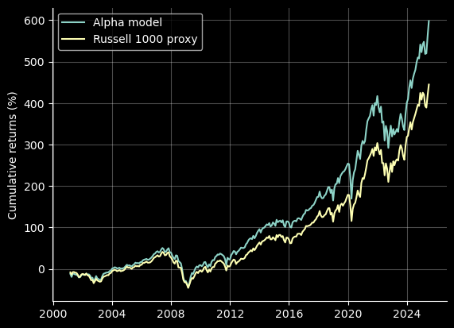
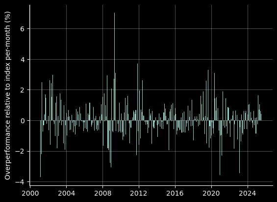
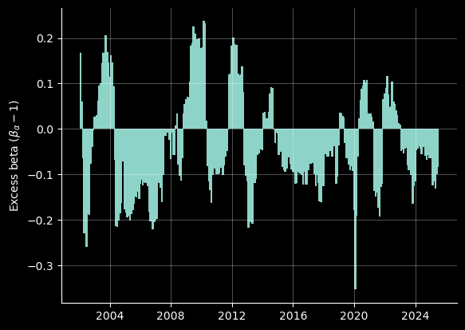

## Quantitative equity portfolio strategies in U.S Equities (1998 to 2025)

If you have stumbled upon this project for the purposes of getting market data, I am unable to provide you any returns data due to licensing issues.

This paper is heavily inspired from the learnings in 'Value and Momentum Everywhere' by AQR. It is almost certain that the strategies and models used in this project are too simple for any institutional investor to actually consider, but it *is* a great project for learning how portfolios are constructed, and how quantitative equity strategies are evaluated.

### Directory structure

The directory is broken down into:

- `/data`: which contains `SQL` schemas and data cleaning.
- `/readme_charts`: the charts used in this `readme`.
- `/research`: the bulk of the work - the research regarding strategies, factors, and portfolio construction

### Strategies in this project

The strategies derive from the same alpha model, which is (in general), a `VALUE/MOMENTUM` factor model with some other factors like `SIZE`, and possible a `VOLATILITY` scaling component. We target 3-month returns. We have for some stock $s$
at month $t$, a predicted return

$$ \hat{r}_{st} = \beta_1 \cdot \texttt{VALUE}_{st} + \beta_2 \cdot \texttt{MOMENTUM}_{st} + \beta_0$$

Then, a stock's "alpha score" $S_{st}$ on month $t$, is the $z$-score of $\hat{r}_{st}$ taken cross-sectionally per-month, across the entire universe. Note the above is similar to the model seen in `Value and Momentum Everywhere` by `AQR` (although they take a composite signal there).

#### Alpha Extension (`130/30`)

Alpha extension can be split into two components; a long-only, index tracking component (which is `100%` of our long), and then a `30/30` market-neutral, alpha-seeking component. The `30/30` component will be correlated with our `EMN` portfolio, but will also have index-tracking components.

Functionally, it finds constituents to overweight and underweight from an index-passive portfolio to seek alpha.

- Benchmark: `Russell 1000` (we'll test both against our proxy and the actual index)
- Total exposure: `160%`
- Leverage ratio: `1.6:1`

#### Equity Market Neutral (`100/100`)

In EMN, we target a 0 beta to the market, and seek absolute returns.

- Benchmark: 3-month treasury bill
- Total exposure: `200%`
- Leverage ratio: `2:1`

## Results of the strategies

### Alpha extension strategy (`130/30`)

#### Details of the fund and strategy

The fund is an index-tracking portfolio with an alpha overlay, which is a `30/30` market neutral component. The market neutral component is weighted with inverse volatility.

We used all available factors, while sector neutralising for value.
- `EV/EBITDA`
- `PS`
- `PE`
- `PB`
- `EV/EBIT`
- `MOMENTUM`

In our factor database, all of our factors are normalised and are flipped in such a way that $> 0$ indiactes a positive forward-looking alpha.

#### Returns, factor exposures and historical $\beta$

Pre-borrow and shorting costs, but post-transaction costs, we find our alpha model overperforms the index with a `5 bps` transaction cost assumption.

    

    

    

This was found using a inverse-volatility portfolio weighting for the `alpha overlay`, and so the portfolio results may be improved by using a more involved `mean-variance optimisation`.

- Sharpe (pre-borrow, pre-short, institutional tc): `0.52`
- Mean annualised return: `8.9%`
- Mean annualised volatility: `17.0%`

We can also consider the beta for the strategy across history, at a rolling 1-year basis. The chart below considers the "excess" beta - that is the delta between the alpha strategy's beta to the market and a $\beta = 1$.

    

We can see a big drop in the market exposure during large drawdowns like 2020, and that overall, the strategy is slightly underexposed to the market.

We can also view the factor exposures throughout history

    

Some interesting observations is the heavy underweighting of `momentum` during and post-GFC, as well as the over-weighting of `EV/EBIT` during COVID-19. This may have been due to the breakdown in valuation factors, and thus the model relied more on `EV/EBIT` and `EV/EBITDA` for predictiveness.

### Equity market nuetral strategy (`100/100`)

With the equity market neutral strategy, we see less consistent success - but still an overperformance of our chosen benchmark (`13-week treasury bills`).

    

We can observe significant drawdowns; many of which are extended and don't recover for extended periods of time. If this were a real fund, than it's likely that the fund would be closed pretty quickly in periods like 2012 - 2018, when the strategy almost has no real returns.

    

We observe a low beta of $\beta = 0.13$.
- Sharpe: `0.29`
- Annualised return: `4%`
- Annualised volatility: `14%`