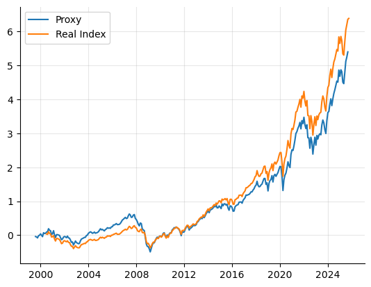

## Quantitative equity portfolio strategies in U.S Equities (1998 to 2025)

If you have stumbled upon this project for the purposes of getting market data, I suggest you read my disclaimer about the data. For all of the strategies/models in this project, we target the `Russell 1000` universe (a proxy of it), with a yearly-rebalanced market cap sorted portfolio.

    

### Strategies in this project

The strategies derive from the same alpha model, which is (in general), a `VALUE/MOMENTUM` factor model with some other factors like `SIZE`, and possible a `VOLATILITY` scaling component. We target 3-month returns. We have for some stock $s$
at month $t$, a predicted return

$$ \hat{r}_{st} = \beta_1 \cdot \texttt{VALUE}_{st} + \beta_2 \cdot \texttt{MOMENTUM}_{st} + \beta_0$$

Then, a stock's "alpha score" $S_{st}$ on month $t$, is the $z$-score of $\hat{r}_{st}$ taken cross-sectionally per-month, across the entire universe. Note the above is similar to the model seen in `Value and Momentum Everywhere` by `AQR` (although they take a composite signal there).

#### Alpha Extension (`130/30`)

Alpha extension can be split into two components; a long-only, index tracking component (which is `100%` of our long), and then a `30/30` market-neutral, alpha-seeking component. The `30/30` component will be correlated with our `EMN` portfolio, but will also have index-tracking components.

Functionally, it finds constituents to overweight and underweight from an index-passive portfolio to seek alpha.

- Benchmark: `Russell 1000` (we'll test both against our proxy and the actual index)
- Total exposure: `160%`
- Leverage ratio: `1.6:1`

#### Equity Market Neutral (`100/100`)

In EMN, we target a 0 beta to the market, and seek absolute returns.

- Benchmark: 3-month treasury bill
- Total exposure: `200%`
- Leverage ratio: `2:1`

### Results of the strategies

To be updated.

### Disclaimer about data

All of the market data I used for this project comes from `Sharadar`. In particular, I used two of their data packages that can be publicly bought from `Nasdaq Data Link`:

- `Sharadar Equity Prices`
- `Sharadar US Core Fundamentals`

You are welcome to re-create my results with the above data; and I am also welcome to hear about data issues that may occur in these above two data sets. Perhaps the first thing you learn when you work in quantitative finance, particularly in more higher frequency data (but in all data in general), is that you should *never trust the data you work with*.